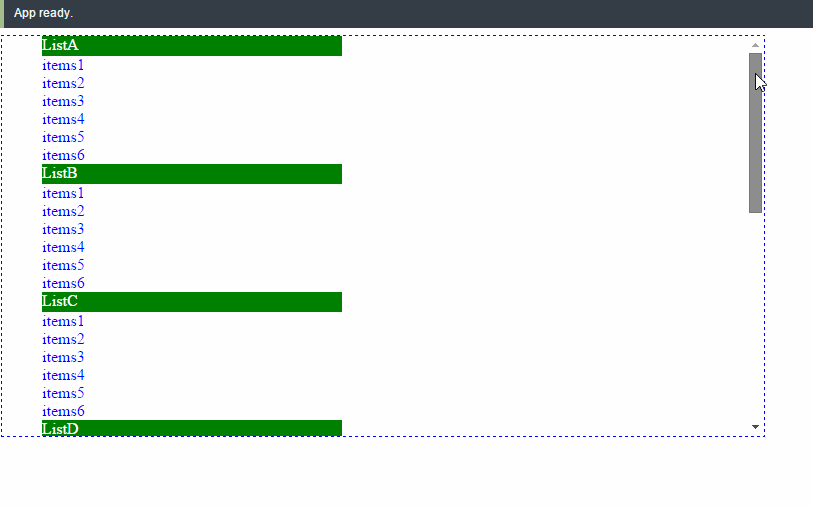

[](https://gitter.im/cht8687/help)

<big><h1 align="center">React listview with sticky header</h1></big>

<p align="center">
  <a href="https://www.npmjs.com/package/react-listview-sticky-header">
    
  </a>

 <a href="https://coveralls.io/github/cht8687/react-listview-sticky-header?branch=master">
    
 </a>

  <a href="https://travis-ci.org/cht8687/react-listview-sticky-header">
    
  </a>

  <a href="https://npmjs.org/package/react-listview-sticky-header">
    
  </a>

  <a href="https://david-dm.org/cht8687/react-listview-sticky-header.svg">
    
  </a>

  <a href="https://github.com/cht8687/react-listview-sticky-header/blob/master/LICENSE">
    
  </a>
</p>

<p align="center"><big>

</big></p>





## Installation

### npm

```
$ npm install --save react-listview-sticky-header
```

Since React is peer dependency, you need to install it manually if you haven't. 


## Demo

[http://cht8687.github.io/react-listview-sticky-header/example/](http://cht8687.github.io/react-listview-sticky-header/example/)


## Usage

```js
<ReactListView 
        data={data} 
        headerAttName="headerName"
        itemsAttName="items" 
        styles={styles}
      />
```

## Options

#### `data`: PropTypes.array.isRequired

```js
const DATALIST = [
{
 	headerName : "ListA",
    items : [{
      title : "items1"
    }, {
      title : "items2"
    }]
},
{
 	headerName : "ListB",
    items : [{
      title : "items1"
    }, {
      title : "items2"
    }]
}
];
```

#### `headerAttName`: PropTypes.string.isRequired

variable name of header in your `data` object.
In above example, it's `headerName`.

#### `itemsAttName`: PropTypes.string.isRequired

variable name which hold items data in your `data` object.
In above example, it's `items`.

#### `styles`: PropTypes.object.isRequired

```js
let styles = {
  outerDiv: {
    height: '400px',
    overflowY: 'auto',
    outline: '1px dashed blue',
    width: '400px',
  },

  ul: {
    margin: '0px',
    listStyleType: 'none',
    padding: '0'
  },

  fixedPosition: {
    position : 'fixed',
    width : '383px',
    top: '0px'
  },

  listHeader: {
    width: '383px',
    height: '20px',
    background: 'green',
    color: 'white'
  },

  listItems: {
    color: 'blue'
  },
};
```

`outerDiv`, `ul`, `fixedPosition`, `listHeader`, `listItems` are required, you can modify the CSS to meet your needs.


## Development

```
$ git clone git@github.com:cht8687/react-listview-sticky-header.git
$ cd react-listview-sticky-header
$ npm install
$ webpack-dev-server
```

*tip:* If you have already had webpack-dev-server running, you might have EADDRINUSE error, please ensure the port is not in use.

Then

```
open http://localhost:8080/webpack-dev-server/
```

## License

MIT
